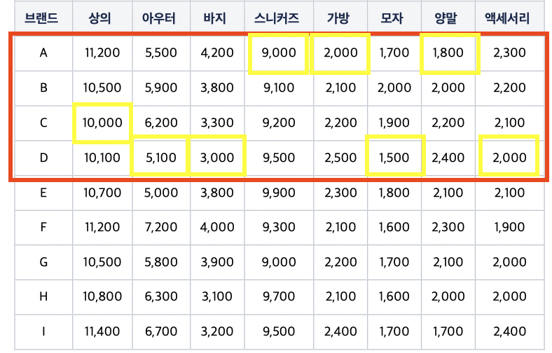

# 무신사
## 무신사 Test Api

App 과 Front-end 개발자가 사용할 수 있도록 상황에 맞는 API 를 구현합니다. 

## 시스템의 요구사항들

### 기능 요구 사항

1. 모든 카테고리의 상품을 브랜드 별로 자유롭게 선택해서 모든 상품을 구매 할 때 최저가 조회 API
2. 한 브랜드에서 모든 카테고리의 상품을 한꺼번에 구매 할 경우 최저가 및 브랜드 조회 API
3. 각 카테고리 이름으로 최소,최대 가격 조회 API
4. 브랜드 상품 가격 추가, 업데이트, 삭제 API

### 확장된 요구사항

- 저장소를 사용하여 저장하고, 저장되는 저장소는 언제든지 변경이 될 수 있습니다.
- 서비스 특성상 빠르게 응답 할 수 있는 방법을 고려해야 합니다
- API 응답이 실패 할 경우, 실패값과 실패 사유를 전달합니다.
- 구매 가격 외의 추가적인 비용(예, 배송비 등)은 고려하지 않고, 브랜드의 카테고리에는 1 개의 상품은 존재한다고 가정합니다.
- 구매를 고려하는 모든 쇼핑몰에 상품 품절은 없다고 가정합니다.

## 시스템 디자인

요구사항의 해결을 위한 가장 간단한 방법은 데이터를 DB에 넣고 SQL쿼리를 통해 원하는 형태의 데이터를 추출하는 방법을 생각해 볼 수 있습니다.

**이 방법의 생각해 볼만 한 문제들:**

1. 저장소는 언제든지 변경될 수 있다는 요구사항이 있습니다. SQL로 원하는 데이터를 추출하기 때문에 최저가 데이터를 찾는 시스템의 비지니스 로직은 SQL에 들어 있다고 볼 수 있습니다. 필요에 의해 저장소가 RDB가 아닌 NoSQL로 변경되는 경우를 생각해보면 어떨까요?
2. 서비스 특성상 빠르게 응답 할 수 있는 방법을 찾아야 합니다. 데이터가 매우 많은 경우라면 어떨까요?

**문제 해결 방법:**

저장소 변경의 문제를 위해 비즈니스 로직을 저장소가 아닌 시스템이 갖을 수 있다면 좋을 것 같습니다. 저장소는 단순하게 데이터를 저장하는 용도로만 사용할 수 있습니다. 저장소의 변경시 비즈니스 로직은 신경쓰지 않고 데이터 형태만 맞춰서 변경해주면 쉽게 저장소의 변경이 가능할 것 같습니다.

데이터가 매우 많다고 가정했을때 매번 조회시마다 최저가, 최고가를 계산하는건 부담이 될 수 있습니다. 저장소에 이미 최저가가 지정되어 있다면 매번 전체를 스캔하며 계산하지 않고 바로 값을 찾아올 수 있을것 같습니다.

### 추가, 업데이트, 삭제시 최저가를 지정한다.

추가, 업데이트, 삭제시에 저장소에 저장하기 전에 현재 상품의 최저가 또는 최고가를 조회하여 가격을 비교 후 최저가라면 최저가로 지정하는 프로세스를 넣는 것을 생각해 볼 수 있습니다.

비즈니스로직을 시스템이 갖고 있기 때문에 이전에 생각해본 저장소 변경에서 데이터의 형태만 신경쓰며 변경할 수 있을 것 같습니다. 단순 데이터 저장과 조회로 구현될 수 있습니다.

데이터가 매우 많은 상황을 가정했을때 조회할때 계산을 하지 않고 이미 지정되어 있는 최저가 값만 가지고 오면 되기 때문에 부담을 덜할 수 있을 것 같습니다.

추가, 업데이트, 삭제에 대해서는 단순하게 상품을 저장하는것이 아닌 최저가를 조회하고 비교하는 로직이 생겼는데요.  데이터를 추가, 업데이트, 삭제하는 트래픽 보다는 읽기에 대한 트래픽이 많은 상황일 수 있다고 예상해 구성하였습니다.

상품 구성의 `카테고리`, `브랜드`, `가격`외 아래의 flag 값을 추가하여 최저가, 최고가를 지정할 수 있도록 하였습니다.

- `category_min`: 카테고리의 최저가를 나타내는 flag 값.
- `category_max`: 카테고리의 최고가를 나타내는 flag 값.
- `brand_category_min`: 브랜드내의 카테고리 최저가를 나타내는 flag값

## API 구현

### 모든 카테고리의 상품을 브랜드 별로 자유롭게 선택해서 모든 상품을 구매할 때 최저가 조회 API

최저가의 조회의 브랜드 파라미터가 유동적이라 최저가를 미리 계산해 놓을 수 없습니다. 따라서 이 API의 경우는 상품을 조회시 계산하여 제공하는 방법으로 구현해야 할 것 같습니다. DB쿼리를 통해 계산할 수 있겠지만 저장소가 RDB가 아닌 형태로의 저장소로 변경을 예상했으므로 시스템에서 계산하도록 합니다.

만약 브랜드가 매우 많을 경우 시스템에서 하나씩 비교하기에는 트레이드 오프가 발생할 수 있을것 같습니다. 캐시의 적용을 생각해볼 수 있겠습니다.

**입력값:**

- 브랜드 복수 선택: (예: A, B, C, D)

**결과값:**

샘플데이터 예시:

**리턴 결과값**

### 한 브랜드에서 모든 카테고리의 상품을 한번에 최저가 및 브랜드 조회API

브랜드내에 최저가를 모두 합한 값을 조회합니다. D브랜드에 카테고리인 `상의`가 `10,100`, `11,100` 두 개의 상품이 있다면 최저가인 `10,100`으로 합산되어야 합니다.

D브랜드의 카테고리 상품이 추가될때 브랜드 카테고리의 최저가인 값을 가지고 와서 비교 후 최저가라면 최저가를 표시하는 flag를 남기는 방식으로 구현하였습니다. 데이터 저장시에는 별도의 DB조회가 필요하지만 조회시에는 간단하게 조회할 수 있습니다.

**조회:**

입력된 브랜드의 `brand_category_min` flag값으로 조회

**입력값:**

- 브랜드

**결과값:**

- D브랜드 → 36100원

### 카테고리 이름으로 최소, 최대 가격 조회 API

카테고리 이름으로 어떤 브랜드의 상품이 최저가, 최고가 인지를 조회합니다.

브랜드에 카테고리 상품을 추가할때 미리 카테고리의 최저가를 비교하여 저장하는 방식으로 구현합니다. 역시 저장시에는 별도의 DB조회가 필요해집니다. 조회시에는 계산 없이 간단하게 조회할 수 있습니다.

`category_min`: 카테고리의 최저가를 나타내는 flag 값.

`category_max`: 카테고리의 최고가를 나타내는 flag 값.

- 입력값: 카테고리명(예: 상의)
- 결과값
    - 최소: C브랜드 → 10,000원
    - 최대: I브랜드 → 11,400원

